# Jane Street Market Prediction

[Jane Street](https://www.janestreet.com/), the sponsor of this [competition](https://www.kaggle.com/c/jane-street-market-prediction), is a *quantitative trading firm with a unique focus on technology and collaborative problem solving*. The challenge is to build a model that receives short-term trade opportunities and decides for each one whether to act and execute the opportunity or to dismiss it.

It's a tough forecasting problem given..


* the fact that a strategy that works well with past data is unlikely to do so in the future. The relationship of the features with the response is constantly changing. It's difficult to avoid overfitting.


* the uncertainty introduced by volatility. Different volatility regimes require different strategies.


* a low signal-to-noise ratio and multicollinearity that could hinder the learning process.


* a time constraint during inference. The inference is done in "real time" as opportunities come up one at a time in a loop. The average iteration should not exceed (roughly) 16 ms.


The code of this project can be found in [here](https://github.com/codefluence/jane_street).

<br>

### EDA

The data for the training consists of around 2.5 million data points spanning 500 days (about 2 years). The final test data will be disjoint in time, it's in the future and spans roughly 1 year.

The trade opportunities are described by 130 anonymized market data features, all of them continuous except for a binary feature with values -1 and +1 (very likely the **side** of the trade opportunity: buy or sell).

In addition, each trade opportunity has a **date id** and a **trade opportunity id** (also anonymized but in chronological order according to Jane Street).

There is no way to link different trade opportunities to the same security, so even if the data has a time component this problem is not a pure time series problem.

**weight** is another variable provided by Jane Street, representing the weight of selected trades in the final score. It could be seen as the quantity of the trade. Around 17% of the trade opportunities have weight = 0, these have no impact in the final score but could be useful during training.

The **response** variable (resp) represents the profit/loss per security unit in some specific fixed time horizon determined by Jane Street. The profit/loss of a trade is then weight * response.

Responses at other time horizons (resp_1, resp_2, resp_3, resp_4) are also available but these won't be used in the evaluation metric.

    
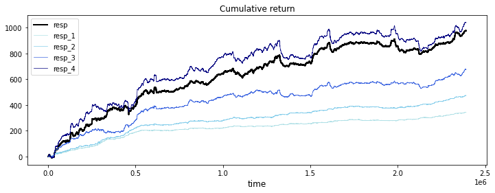
    


All time horizons have a positive trend throughout the two years (financial markets usually have a positive trend in the long term). resp1 and resp2 carry less volatility and lower returns which suggests their time horizons are shorter. Resp3 is somewhere in the middle and resp4 is close to resp but probably further in time.

There is a negative correlation between the absolute value of response and weight.


    
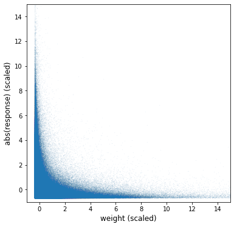
    


The potential size of the response is related to its volatility. Jane Street is putting less weight on risky opportunities - it's difficult to recover from big losses. The criteria in the risk measurement is unknown but probably related to historical volatility and liquidity.

The following plots show the evolution of returns and the total weight allocated by Janes Street day by day (500 days).


    
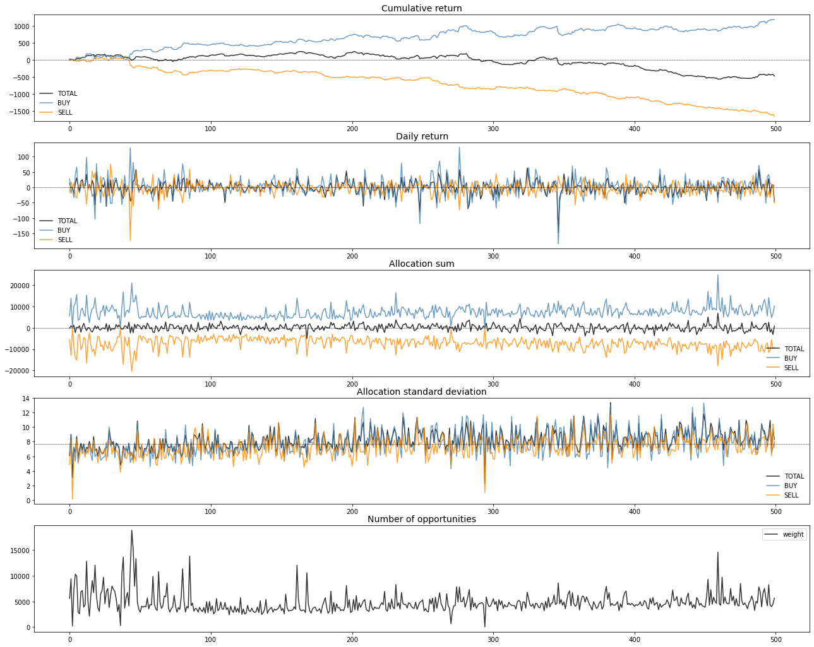
    


A couple of observations:

* Buy opportunities are more profitable in the long term. Still, sell opportunities help to reduce risk in the short term through hedging.


* It looks Jane Street increases the allocated total weight in the opportunities during volatile periods.


<br>

The anonymous features can be classified in groups based on trend, heteroscedasticity and pattern.

The following plots show an example for each group, with values from four different days with different market conditions (bullish/bearish, volatile/nonvolatile). The color represents the side of the trade (red: sell, blue: buy). The size of the dot represents the weight.

* With no trend and no heteroscedasticity: 1, 2, 9, 10, 15, 16, 19, 20, 25, 26, 29, 30, 35, 36, 46-52, 69-76, 79-82


    
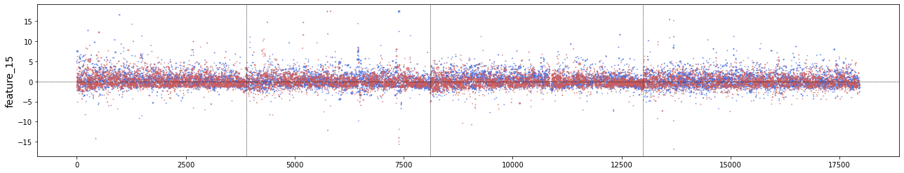
    


* With no trend and with heteroscedasticity: 3-8, 11-14, 17, 18, 21-24, 27, 28, 31-34, 37-40, 77-78, 83


    
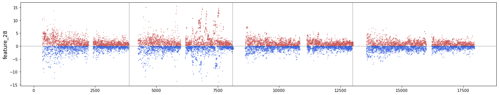
    


* With trend and no heteroscedasticity: 109, 112, 115, 122-129

    
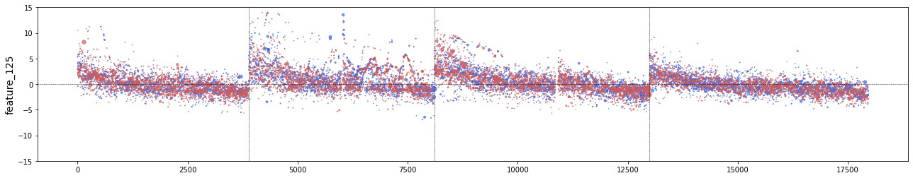
    


* With trend and heteroscedasticity: 53-59, 84, 89, 90, 95, 96, 101, 102, 107, 108, 110, 111, 113, 114, 116-121


    
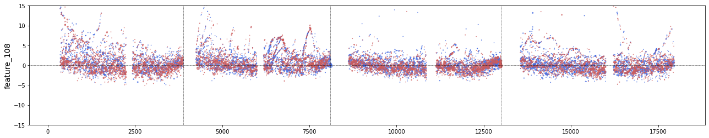
    


* With a "stratified" pattern (probably related to price or tick size values): 41-45


    
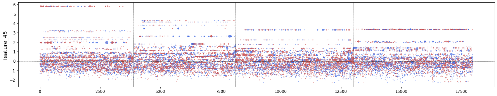
    


* With a time pattern (feature 64 seems to represent time - note that the opening and the closing of the market are busier): 60-68


    
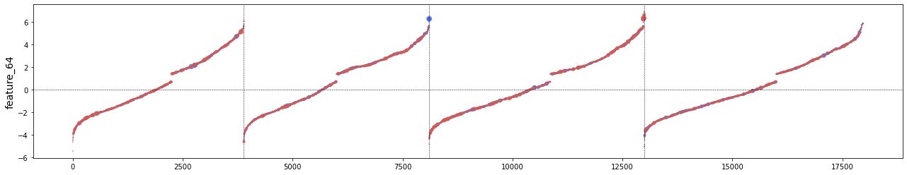
    
    
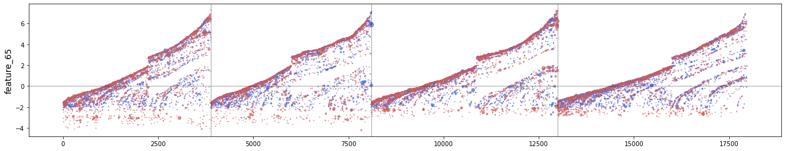
    


* With a pattern where one of the sides is "fixed" around a specific value: 85-88, 91-94, 97-100, 103-106

    
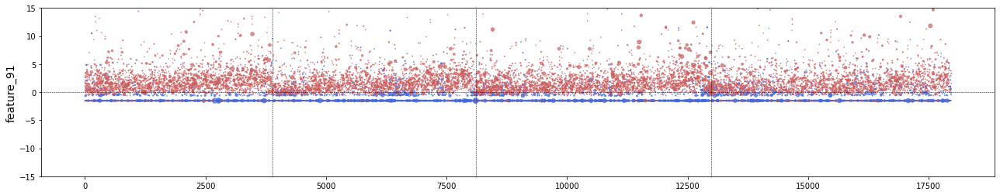
    


<br>

### Utility score

As described in the [evaluation description](https://www.kaggle.com/c/jane-street-market-prediction/overview/evaluation) of the competition:

*This competition is evaluated on a utility score. Each row in the test set represents a trading opportunity for which you will be predicting an action value, 1 to make the trade and 0 to pass on it. Each trade j has an associated weight and resp, which represents a return.*

*For each date i, we define:*

$p_i = \sum_j(weight_{ij} * resp_{ij} * action_{ij})$

$t = \frac{\sum p_i }{\sqrt{\sum p_i^2}} * \sqrt{\frac{250}{|i|}}$

*where  is the number of unique dates in the test set. The utility is then defined as:*

$u = min(max(t,0), 6)  \sum p_i$

In summary, picking up profitable trades is not good enough to get a high score, it's also important that the profit is evenly distributed across time. Having a bad trading day will be specially penalized.

The following plot shows the utility score map of the first half of the training data (1 year) when the response of the selected opportunities are within a [floor,ceiling] range.

    
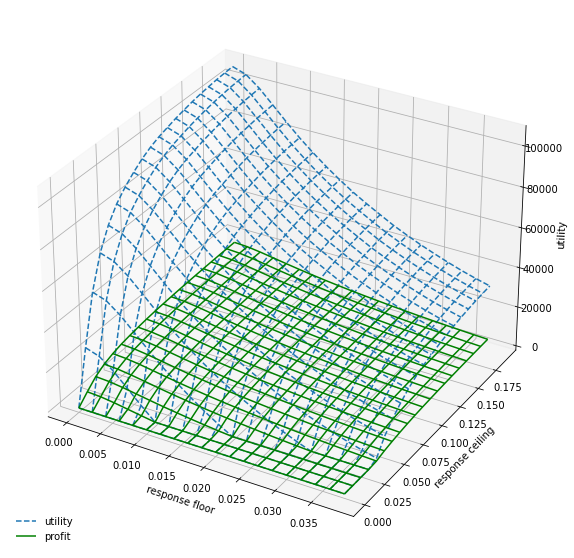
    


<br>

### Feature correlation

The anonymized features form clear correlation clusters but none of them have significant correlation with the response (first row):

    
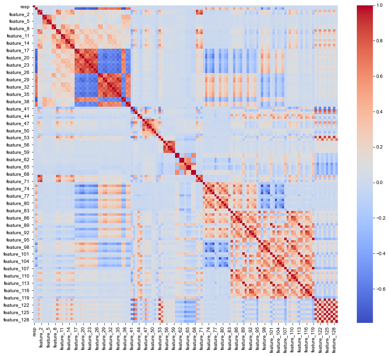


The correlation of features to the response keeps constantly changing. The plot below shows two of the features that are more correlated to the response in the first 200 day. The variance is high and both feature correlations to the response seem uncorrelated with each other.

    
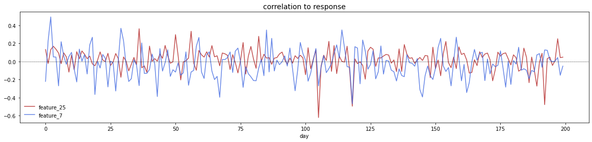
    


<br>

### Missing values and imputation

Missing values seem to follow a time pattern. The same set of features are always blank at the beginning of the day and during what it seems a market break. The missing values are probably caused by missing historical data required to compute the values.

I used the mean of the previous 100 trade opportunities (for the same feature_0 value) for imputation, kind of a moving average imputation.

   
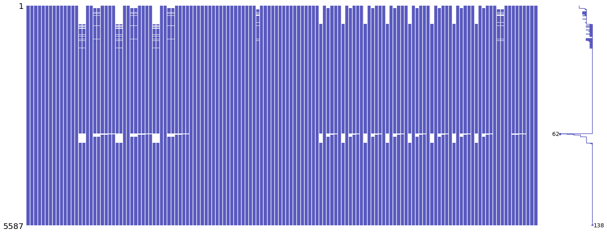
    


<br>

### Day grouping for model validation

To fit the prediction models, the data was split in 4 folds, each one containing mutually exclusive days. The goal is to avoid day information leakage, since each day has its own particular mood and is impacted by financial news that only apply to that day. The model should not rely on the particular information of the day because it won't probably reproduce again in the future.

Between keeping training and validation days as much as isolated as possible (first x days are for training, last y days are for validation) and trying to include as much time variance in the validation set as possible (spreading validation days across the whole period) I went for the latter. In my experiments I didn't find obvious overfitting caused by mixing validation days with training days. The critical part is to avoid intraday data leakage.

```
1st partition:
training days: 0, 1, 2,  4, 5, 6,  8, 9, 10, ...
validation days: 3, 7, 11, ...

2nd partition:
training days: 1, 2, 3,  5, 6, 7,  9, 10, 11, ...
validation days: 0, 4, 8, ...

etc
```


<br>

### Trend classification model

In this prediction model the approach to decide the action to take is to determine the expected response trend. A positive expected trend would trigger the action to take the trade opportunity. The chosen model is a fully connected neural network with a cross-entropy loss function classifying opportunities with positive or negative trends. A more statistical model could also have been a good choice given the nature of the problem.

The **target** in the classification could be response > 0, however the response has a fragile relationship with the features and this relationship is constantly changing over time, so using too much information from the response could lead to overfitting easily. In order to mitigate this I used instead the mean of the responses from all the time horizons provided. This value will be less noisy as it includes shorter time horizons easier to predict.

PCA and an encoder/decoder network to **denoise** and compress the original features were tested but with no significant change in the results so I decided to use the original features (scaled) straight away to avoid wasting the limited time per inference iteration. It seems that the network deals with noise and collinearity well.

**Feature engineering** is not obvious with anonymized data. I end up feeding the model with a few pairs of features multiplying each other. The idea is to help the learning with significant feature interactions. To select the pairs I trained several TabNet models. Interactions with the highest coefficients in TabNet explanations were selected (6 in total). The addition of these interactions seemed to help with the score a bit in both local CV and public score.

**Generalization** is always key in any prediction problem, but performance will be specially sensitive to overfitting with financial data. Some decisions to take care of generalization were:

* The model limited to 3 layers with the following setup:

```
batch_norm -> fully_connected -> leaky_relu -> dropout
```

* Dropout set to high rates (0.35 in the 1st layer, 0.4 in the 2nd layer, 0.45 in the 3th layer). The same setup has been tested with lower dropout rates (0.2) and the validation score was just slightly better, so I kept the extra regularization.


* Blending of pairs of data points as proposed in the paper [mixup: BEYOND EMPIRICAL RISK MINIMIZATION](https://arxiv.org/pdf/1710.09412v2.pdf). This way the new data points fill the "empty" space in the training data, which helps to soft the fitting. Also, with this technique is possible to learn the information in data points with weight=0. The blending proportion follows a beta distribution. I chose parameter values to make the distribution close to a uniform in order to increase the level of "mixup".

   
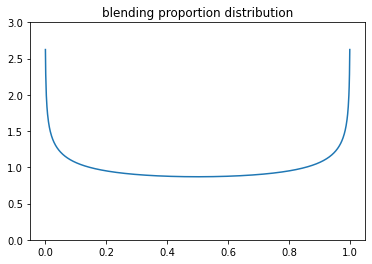
    


The utility score is based on the weighting provided by Jane Street and the response. To bring the attention of the model to trade opportunities that will be more important in the score, data points are **weighted** in the cross-entropy loss function:

```
min(jane street weight * abs(mean(responses from all time horizons)), 0.4)
```


<br>

### Utility maximization model

Another completely different idea I tried was to plug the utility score function directly as loss function (multiplied by -1 to maximize).

Compared to the cross-entropy function, the utility score function already weights the importance of trade opportunities based on response and Jane Street weight. To soften the influence of the response values which would introduce quite a lot of overfitting, the utility score function is modified to randomly pick the response from different time horizons. This avoids overfitting in two ways: more predictable shorter time horizons and more time variability in the response.

On top of that, noise was added to the response in proportion to its magnitude (standard deviation = response/2).

Same layers, dropout rates and data blending technique used in the classification network is applied here, but in another attempt to make this model different and still reduce overfitting, the following features were used instead of the original ones:

* A prediction of the general market direction of the day.


* A prediction of the general volatility of the day.


* Z-scores of the original features of the trade opportunity in regard to the means of the features of the previous 100 opportunities (for the same side, buy or sell).


To get the market trend/volatility of the day I fit linear models to the means/stds of the responses grouped by day.


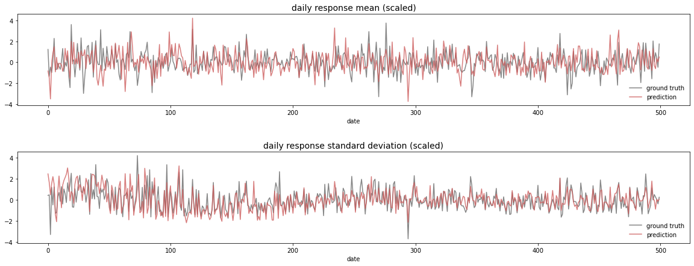
    


During inference, the means of the features of the last 100 trade opportunities (per side) is computed to feed to the linear models that will generate the predictions as features for the neural network. The error of these linear models is low because it's much easier to predict the market regime of the current day (information already contained in the historical data of the trades features) than to predict the trend and volatility of a single trade.

The hope is to provide the network model with some context to each trade opportunity so it's able to somehow adjust the risk depending on the market regime and the divergence of the trade from that regime (Z-scores).

The results with this model are close to the results with the trend classifier:

| Split | Trend classification | Utility maximization |
| --- | --- | --- |
| CV0 | auc=0.530, utility=2275.5 | auc=0.53-val, utility=1942.3 |
| CV1 | auc=0.531, utility=1317.1 | auc=0.52-val, utility=1356.7 |
| CV2 | auc=0.527, utility=0983.8 | auc=0.52-val, utility=0364.6 |
| CV3 | auc=0.524, utility=2777.6 | auc=0.52-val, utility=3411.9 |
